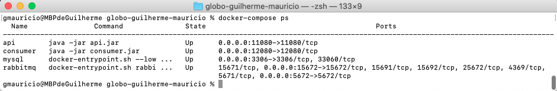

# Desafio Backend Java


## O Desafio
### O desafio se trata de atualização das assinatura do usuário de acordo com notificações.


#### Tipos de Notificações:

-  SUBSCRIPTION_PURCHASED - A Compra foi realizada e a assinatura deve estar com status ativa.

-  SUBSCRIPTION_CANCELED - A Compra foi cancelada e a assinatura deve estar com status cancelada.

-  SUBSCRIPTION_RESTARTED - A Compra foi recuperada e a assinatura deve estar com status ativa.


### Etapas

- Recebimento Notificação HTTP
- Enfileiramento
- Processamento e Persistencia

## Considerações Gerais
Você deverá usar este repositório como o repo principal do projeto, i.e.,
todos os seus commits devem estar registrados aqui, pois queremos ver como
você trabalha.

Esse problema tem algumas constraints:

1. Linguagem : Java 8 ou mais atualizada

2. Framework: Spring

3. Database: Qualquer database relacional

4. Deve ser possível conseguir rodar seu código em um Mac OS X OU no Ubuntu;

5. O RabbitMQ deve ficar dentro de um compose(Docker)

6. Devemos ser capazes de executar o seu código em um ambiente local de alguma forma automatizada:

   ``` git clone seu-repositorio
    cd seu-repositorio
    ./configure (ou algo similar)
    docker-compose up -d
    make run (ou algo similar como java -jar desafio.jar)
    make sendNotifications 
    
    
    obs: Não necessariamente deve ser dessa forma, mas precisa estar automatizada e documentado.
   ```

7. Devemos ter automatizadas as chamadas para a api com as notificações em anexo no arquivo [notificacoes.txt], obrigatoriamente seguindo a ordem do arquivo (OBS: Pode ser feito em qualquer linguagem de programação). 

Esses comandos devem ser o suficiente para inicializar o RabbitMQ, a aplicação Java e as chamadas para a API. Pode se considerar que temos instalado no meu sistema: Java, Python e Ruby e Docker.
Qualquer outra dependência que eu precisar você tem que prover.

**Registre tudo**: testes que forem executados, idéias que gostaria de
implementar se tivesse tempo (explique como você as resolveria, se houvesse
tempo), decisões que forem tomadas e seus porquês, arquiteturas que forem
testadas, os motivos de terem sido modificadas ou abandonadas, instruções de
deploy e instalação, etc. Crie um único arquivo COMMENTS.md ou HISTORY.md no
repositório para isso.


## Modelo do Banco de Dados


## Execução
Após as inicialização do ambiente(Docker/Rabbit/Aplicação), executar o script de envio das Notificações e espera-se que o status da assinatura esteja conforme as notificações recebidas, além disso deve ter conter todo o histórico de notificações para cada assinatura para um possível auditoria.


### O que será avaliado na sua solução?

-  Seu código será observado por uma equipe de desenvolvedores que avaliarão a
   implementação do código, simplicidade e clareza da solução, a arquitetura,
   estilo de código, testes unitários, testes funcionais, nível de automação
   dos testes, o design da interface e a documentação.
   
- Consistência dos dados persistidos.


### Dicas

- Use qualquer ferramenta dentro framework Spring

- Automatize o máximo possível;

- Em caso de dúvidas, pergunte.

# Desenvolvimento/Execução

   Para o desenvolvimento desse projeto, foram criados dois projetos em Java:
   - **API:** Responsável por receber as requisições HTTP e enviar para fila do RabbitMQ:
   - **Consumer:** Responsável por consumir as mensagens do RabbitMQ e gravar no banco de dados.

# Tecnologias Utilizadas
   - Java 8
   - Spring Boot
   - RabbitMQ
   - MySQL
   - RabbitMQ
   - JPA/Hibernate

# Ferramentas Utilizadas
   - Eclipse
   - Visual Code
   - Postman

# Requisitos Necessários
   - Docker/Compose  

# Execução
   Para execução desse projeto é necessário ter o docker instalado na máquina. Depois de ter baixado o projeto, abra o terminal da sua máquina, então acesse pelo terminal o diretório onde foi baixado o projeto e siga os seguintes passo:

   * #### Baixar o projeto utilizando o git:
   ``` 
      git clone https://github.com/juliocesarnt/globo-guilherme-mauricio.git globo-guilherme-mauricio 
   ```

   1. Executar o comando para fazer o build e aguardar a execução:
      ``` 
         docker-compose build 
      ```

   2. Depois de executado o comando anterior, executar o seguinte:
      ``` 
         docker-compose up -d 
      ```
   3. Para verificar se o processo ocorreu tudo certo, e se a aplicação subiu, rodar o seguindo comando:
      ```
         docker-compose ps   
      ```
      Esperando o seguinte resultado:
      

   4. Para utilizar a API podem ser utilizados os seguintes comandos, no Postman, ou alguma outra ferramenta capaz de fazer requisições HTTP:
      - GET: http://localhost:11080/ ** Retorna uma mensagem que o serviço está no ar.
      - POST: http://localhost:11080/api/send ** Responsável por receber as notificações
        - EX: 
      - POST: http://localhost:11080/api/carga ** Responsável por dar carga no banco, utilizando o arquivo [notificacoes.txt]
   
   5. Para verificar os registros inseridos no banco execute os comandos no terminal:
      ``` 
          docker exec -it mysql bash
          mysql -u root -p
          **digitar a senha: qwerty  
      ```
      Ex: 
 
# URL:
   ## RabbitMQ
   - URL: http://localhost:15672

   ## MySQL
   - TCP/IP: localhost:3306

   ## API
   - URL: http://localhost:11080/
   - URL: POST: http://localhost:11080/api/send
   - URL: POST: http://localhost:11080/api/carga

   ## Consumer
   -URL: http://localhost:12080/

